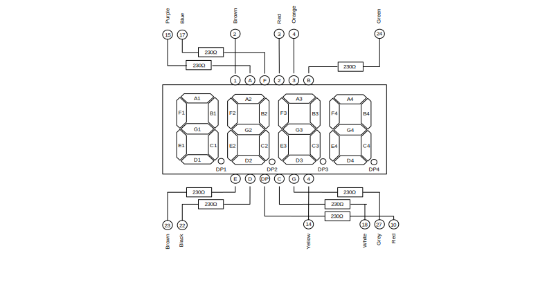

# Automated Cat Feeding Device

A Raspi project to ensure consistent dinner times for the cat when I am not home.


## About

My cat wants food at specific hours. This repository is the blueprint for an automated cat feeding device. You fill it with food, set a timer and it keeps the food until the programmed time is up.

## Hardware

The Automated Cat Feeding Device (ACFD) consists of four hardware modules:

 * [Raspberry Pi Zero, without WiFi](https://www.buyapi.ca/product/raspberry-pi-zero-w/)  

 * [Time Display PCB](timer)  

   * 1x [12 Pin Common Cathode 7-Segment Display](https://www.amazon.ca/DOLITY-Segement-Displays-Common-Cathode/dp/B07GVKQWDX)
   * 7x 230Ω Resistor
   * 1x [Mini PCB](https://www.amazon.ca/Gikfun-Solder-able-Breadboard-Arduino-Electronic/dp/B077938SQF)
   * [Jumper Wires](https://www.amazon.ca/Elegoo-120pcs-Multicolored-Breadboard-arduino/dp/B01EV70C78)
 * [4 Button Keypad](keypad)  

   * 4x [Tactile Push Buttons](https://www.amazon.ca/Ocr-10Value-Tactile-Momentary-Assortment/dp/B01NAJEVE3)
   * 9x 250Ω Resistor
   * 1x [Mini PCB](https://www.amazon.ca/Gikfun-Solder-able-Breadboard-Arduino-Electronic/dp/B077938SQF)
   * [Jumper Wires](https://www.amazon.ca/Elegoo-120pcs-Multicolored-Breadboard-arduino/dp/B01EV70C78)
 * Lid Lifter  

   * 1x [28byj Stepper Motor](https://www.amazon.ca/Titri-28BYJ-48-Stepper-Motor-5V/dp/B07PS2MJCX)
   * 1x [ULN2003 Driver Board](https://www.amazon.ca/ULN2003-Controller-Stepping-Electric-Control/dp/B07P5C2KWX)
   * 1x [Universal Mount Hub](https://www.amazon.ca/Coupling-Connector-Coupler-Accessory-Fittings/dp/B08334MFVT)

## Wiring


 > Black dot marks pin 1

## Casing

Casing consists of 3 bays:

 * Motor bay, houses the *28BYJ-48* Step Motor.
 * Cat food bad, houses the *croquettes*.
 * Electonics bay, houses Pi-Zero, 7 Segment PCB, Tactile PCB and ULN2003 Driver Board


## Software 

Before full assembly, use below scripts to test individual ACFD components:

 * [Display Test](modtest/display-test.py): Test Time Display PCB and wiring with a fast countdown 9999-0000.  
```python3 ./display-test.py```.
 * [Keypad Test](modtest/interruptclick.py): Test Keypad PDB and wiring with on terminal display of pressed buttons.  
```python3 ./keypad-test.py```

...

## Contact / Pull Requests

 * Author: Maximilian Schiedermeier 
 * Github: Kartoffelquadrat
 * Webpage: https://www.cs.mcgill.ca/~mschie3
 * License: [MIT](https://opensource.org/licenses/MIT)

