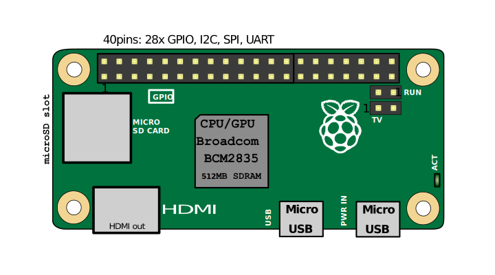
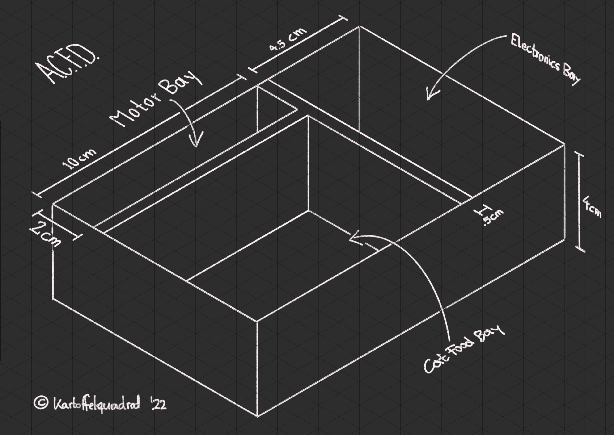

# Automated Cat Feeding Device

A Raspi project to ensure consistent dinner times my cat.


## About

This repository lists material, assembly instructions and software for the **A.C.F.D. MARK-I** (Automated Cat Feeding Device). The device is a one-shot feeder, that is to say it keeps a single portion of cat food under a plexiglas lid. The user sets a due time using 4 tactile buttons and a 4-Digit display. The lid opens when the programmed time is up.

## Hardware

The Automated Cat Feeding Device consists of four modules: (casing and glass not counted)

 * [Raspberry Pi Zero, without WiFi](https://www.buyapi.ca/product/raspberry-pi-zero-w/)  

 > Note: Any raspberry with 20 GPIO pins and 5V output will serve for this purpose. Sadly this excludes the cheaper [Raspi Pico](https://www.pishop.ca/product/raspberry-pi-pico/).
 * [Time Display PCB](timer)  

   * 1x [12 Pin Common Cathode 7-Segment Display](https://www.amazon.ca/DOLITY-Segement-Displays-Common-Cathode/dp/B07GVKQWDX)
   * 7x 230Ω Resistor
   * 1x [Mini PCB](https://www.amazon.ca/Gikfun-Solder-able-Breadboard-Arduino-Electronic/dp/B077938SQF)
   * [Jumper Wires](https://www.amazon.ca/Elegoo-120pcs-Multicolored-Breadboard-arduino/dp/B01EV70C78)
 * [4 Button Keypad](keypad)  

   * 4x [Tactile Push Buttons](https://www.amazon.ca/Ocr-10Value-Tactile-Momentary-Assortment/dp/B01NAJEVE3)
   * 1x 230Ω Resistor
   * 1x [Mini PCB](https://www.amazon.ca/Gikfun-Solder-able-Breadboard-Arduino-Electronic/dp/B077938SQF)
   * [Jumper Wires](https://www.amazon.ca/Elegoo-120pcs-Multicolored-Breadboard-arduino/dp/B01EV70C78)
   * 2x [Lego 1 x 2 Plate](https://www.bricklink.com/v2/catalog/catalogitem.page?P=3023&name=Plate%201%20x%202)
 * Lid Lifter  

   * 1x [28byj Stepper Motor](https://www.amazon.ca/Titri-28BYJ-48-Stepper-Motor-5V/dp/B07PS2MJCX)
   * 1x [ULN2003 Driver Board](https://www.amazon.ca/ULN2003-Controller-Stepping-Electric-Control/dp/B07P5C2KWX)
   * 1x [Universal Mount Hub](https://www.amazon.ca/Coupling-Connector-Coupler-Accessory-Fittings/dp/B08334MFVT)
   * 1x [Hair Pin](https://www.amazon.ca/Goody-Ouchless-Bobby-Black-48/dp/B000NHKVNQ)

## Wiring

Use below pin layout to connect display, keypad and motor driver to the Raspberry.


 > Black dot marks pin 1

## Casing

Below blueprint does not indicate outer walls. Add the required margin strength, depending on your available material. For reference, I used 6mm CDX plywood.



6mm CDX plates:
 * Base plate:  
16.3cm x 12.2cm
 * Left and right wall:  
16.2cm x 5.0cm
 * Front and back wall, electronics bay separator:  
11.0cm x 5.0cm
 * Motor bay separator:
10.5cm x 5.0cm

4mm plexiglass plates:
 * Electronics bay lid:  
12.2cm x 5.3cm
 * Motor bay lid:  
10.4cm x 2.8cm
 * Cat food bay lid:  
11cm x 9.3cm

Component location:
 * Electronics bay:
    * Raspberry-0
    * ULN2003
    * Display PCB
    * Tactile PCB
 * Motor Bay:
    * 28byj Stepper Motor
 * Cat Food Bay:
    * Universal Mount Hub
    * Hair Pin

## Software 

Before full assembly, use below scripts to test individual ACFD components and wiring:

 * [Display Test](modtest/display-test.py): Test Time Display PCB and wiring with a fast countdown 9999-0000.  
```python3 ./display-test.py```.
 * [Keypad Test](modtest/interruptclick.py): Test Keypad PDB and wiring with on terminal display of pressed buttons.  
```python3 ./interruptclick.py```
 * [Motor Test](modetest/motor-test.py): Test ULN2003 and Motor wiring. Performs rotations needed for lid open and close.  
```python3 ./motor-test.py```

To manually run the software, start it with:  
```python3 acfd.py```

For automated start on Raspberry boot, add this line to your ```/etc/rc.local```:  
```python3 acfd.py &``` (ampersand prevents blocking the boot sequence)

## Contact / Pull Requests

 * Author: Maximilian Schiedermeier 
 * Github: Kartoffelquadrat
 * Webpage: https://www.cs.mcgill.ca/~mschie3
 * License: [MIT](https://opensource.org/licenses/MIT)

